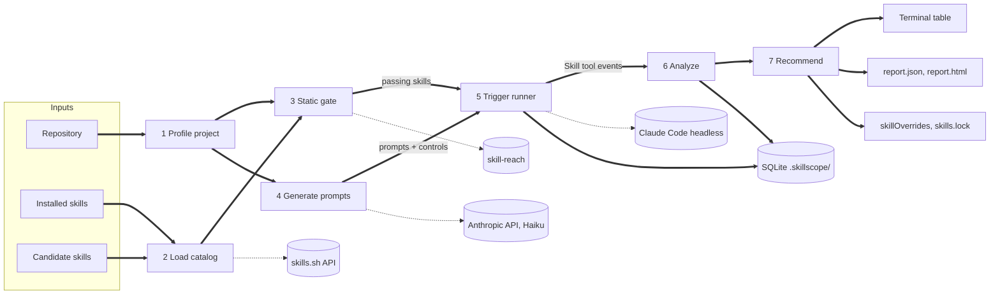

# Skill Catalog Optimizer: Project Overview

Sep 26, 2026 · @Vaibhav Shintre

## What we are building

A command-line tool (working name **skillscope**, Apache-2.0) that points at a repository, takes the skills already installed for Claude Code plus any candidates, and reports which skills fire on that project's real tasks, which ones steal triggers from others, and which ones should be kept, demoted to name-only, or removed. v0 is the shadowing meter only: one command, Claude Code only, static checks plus trigger measurement, no outcome evals, no security scanning beyond a pluggable hook.

The v0 promise: `skillscope scan .` runs in under 15 minutes on a laptop, costs under $2 in API calls on Haiku, and ends with a verdict table plus a `skillOverrides` block you can paste into `.claude/settings.local.json`.

Why this first: the shadowing paper (arXiv 2605.24050) attributes up to a 21 point pass-rate drop to wrong-skill selection as libraries grow, `claude plugin eval` already covers with/without outcome testing for one plugin, and no tool today measures a whole catalog against a specific project. Trigger checks cost one short turn each, so this is the one tier that can run on every project for cents.

## Scope

v0 measures one thing well: whether the right skill fires on this project's prompts, and who gets in the way. Everything that needs a full task run, a container, or a security judgment is out until the meter produces numbers people trust.

| In v0 | Out of v0 (planned later) |
| --- | --- |
| Profile the project: languages, frameworks, lockfile versions, existing `.claude/skills`, CLAUDE.md, recent git history | Outcome evals (with/without pass rate) via `claude plugin eval` and Harbor |
| Load installed skills plus candidates from a local path or skills.sh | Security scanning (Cisco skill-scanner static mode, Snyk opt-in); v0 exposes only a hook that can call an external scanner |
| Static gate: frontmatter lint, listing-budget simulation, description overlap, version claims vs lockfile | Runtime canary secrets and egress logging |
| Generate 30 to 40 project-specific prompts, including should-not-trigger controls | Subset optimizer that trades off cost, lift and risk across the catalog |
| Run each prompt through headless Claude Code under one or more catalog configurations and record which skill fired | Support for Codex, Cursor, OpenCode and other harnesses |
| Per-skill precision and recall, a shadowing matrix, significance flags | Shared results store across users |
| Verdicts: keep, name-only, remove, unverified; emit `skillOverrides` and `skills.lock` | Automatic skill installation from the registry |
| Terminal table, JSON report, static HTML report | Description rewriting or auto-tuning |

Two scoping decisions worth stating. Workflow skills (planning, TDD, brainstorming) are measured for triggering only, never judged as dead weight, because trigger rate says nothing about their value. And v0 never modifies the user's live `.claude` directory; every run happens in a temporary copy of the repo, and the only write back is a file the user applies by hand or with `skillscope apply`.

## Architecture

The system is a linear pipeline of five stages inside one Python package, driven by a CLI, backed by a local SQLite store, and calling four external tools. Two views follow: the flow of data through the pipeline, then the layers of the system.

**Pipeline flow (Mermaid)**



Solid arrows carry data between stages; dotted arrows are calls to external tools. Every stage writes to the store, so a crashed run resumes from the last completed prompt.

**System layers (SVG)**

&#91;embedded content: system layers · interfaces, five stages, store, four external tools\]

The CLI drives the pipeline left to right. The trigger runner is the accented stage because it is the only one that spends money: every other stage is deterministic or cached. The store spans both lower layers because external tool results (registry lookups, Claude Code transcripts) are cached beside pipeline outputs.

## Components

Each stage is a Python module with one entry function that takes the previous stage's artifact and returns the next; stages never call each other directly, which keeps them testable with fixtures and lets `skillscope` resume from any stage.

| # | Stage | Input | Output | Built on | Notes |
| --- | --- | --- | --- | --- | --- |
| 1 | Profiler | Repo path | `stack.json`: languages, frameworks, dependency versions from lockfiles, test command, existing skills, CLAUDE.md size, last 200 commit subjects | `git`, lockfile parsers (package-lock, pnpm-lock, uv.lock, poetry.lock, Cargo.lock, go.sum) | No model calls. Detection heuristics copied from what `vercel skills` does with package.json, extended to versions |
| 2 | Catalog loader | `stack.json`, CLI flags | `catalog.json`: one record per skill with source, commit hash, frontmatter, body, listing text | Filesystem scan of `~/.claude/skills`, `.claude/skills`, plugin dirs; skills.sh v1 API; `npx skills add` into a temp dir | Candidates are never installed into the user's real config |
| 3 | Static gate | `catalog.json`, `stack.json` | `static.json`: per-skill lint findings, budget simulation, overlap pairs, version mismatches, security hook result | skill-reach (overlap and lint), own budget simulator, own version matcher | Fails a skill only for hard problems (malformed frontmatter, empty description, security hook says block); everything else is a warning carried into the report |
| 4 | Prompt generator | `stack.json`, `catalog.json` | `prompts.json`: 30 to 40 prompts, each with an expected skill (or none) and a source | Anthropic API, Haiku, one call; cached by repo hash | Mix: about 60% derived from commit subjects and open issues, 20% user-supplied, 20% should-not-trigger controls drawn from unrelated domains |
| 5 | Trigger runner | `prompts.json`, `catalog.json`, run plan | `events.jsonl`: per (config, prompt, repeat) the skills invoked, turn count, tokens, cost, duration | Claude Code headless (`claude -p` with stream-json output), asyncio subprocess pool, temp copies of the repo | Configurations: full catalog, installed-only, and leave-one-out for the top suspects. Cost cap stops the run cleanly |
| 6 | Analyzer | `events.jsonl`, `prompts.json` | `analysis.json`: per-skill precision, recall, fire rate on controls; shadowing matrix; significance flags | scipy Fisher exact test, pandas | A shadowing edge A→B exists when removing A raises B's recall by a significant margin |
| 7 | Recommender | `analysis.json`, `static.json` | `verdicts.json`, `skillOverrides` snippet, `skills.lock` | Rule table, no model call | Verdicts: keep, name-only, remove, unverified (too few prompts to judge). Every verdict carries its evidence rows |
| 8 | Reporter | All of the above | Terminal table, `report.json`, `report.html` | Rich, Jinja2 | HTML is a single self-contained file so it can be attached to a PR |

The security hook in stage 3 is a subprocess contract: any command that accepts a skill directory and returns JSON with a `block` boolean and findings. The reference adapter shells out to Cisco skill-scanner in static mode; Snyk agent-scan is a second adapter that is off unless the user sets a token, because it uploads skill content.

## Stack and tools

Python 3.12 is the language because every piece we plan to embed or shell out to later (skill-reach, Cisco skill-scanner, Harbor, SWE-Skills-Bench) is Python, and the statistics libraries are there. Node is used only through `npx` for the Vercel skills CLI. The whole tool ships as one `uv`-managed package installable with `uv tool install skillscope`.

| Concern | Choice | Why this one |
| --- | --- | --- |
| Language and packaging | Python 3.12, `uv`, `pyproject.toml`, Apache-2.0 | Matches the ecosystem we wrap; `uv tool install` gives users a single command with no venv management |
| CLI | Typer with Rich output | Typed commands, automatic help, good tables and progress bars in the terminal |
| Schemas | Pydantic v2 models for every stage artifact | Each JSON file on disk validates against a model, so stages can be replayed from files |
| Store | SQLite via the standard library, one file at `.skillscope/store.db`, plus JSON artifacts per run | Zero dependencies, easy to inspect, survives partial runs; JSON copies keep the report reproducible without the DB |
| Concurrency | `asyncio` subprocess pool, default 4 parallel Claude Code sessions | Claude Code is rate-limited per account; 4 keeps runs under the limit while finishing 40 prompts in minutes |
| Statistics | `scipy.stats` (Fisher exact test), `numpy` | Same test agent-crucible uses; small counts need an exact test, not a normal approximation |
| HTTP | `httpx` | Async client for the skills.sh v1 API and the Anthropic API |
| Model calls | Anthropic Python SDK, Haiku for prompt generation | One call per run; cached by repository content hash so re-runs are free |
| Agent harness | Claude Code CLI in headless mode, stream-json output, `--setting-sources project` so only the temp copy's skills load | The harness the user actually runs; the Skill tool event in the stream is the ground truth for "which skill fired" |
| Overlap and lint | skill-reach (Apache-2.0) as a library dependency | Already does description overlap, collision ranking and listing-budget lint; embedding it saves weeks |
| Security hook | Subprocess contract; reference adapter for Cisco skill-scanner, optional Snyk agent-scan | Keeps scanners out of our dependency tree and lets users pick one; scanners change monthly |
| Registry | skills.sh v1 API for search and install counts; `npx skills add` for fetching into a temp dir | Largest index and the only one with an install-count signal and a lockfile format we can reuse |
| Reports | Rich tables, Jinja2 templates to one HTML file, plain JSON | No web server; a report is a file you can attach to a PR |
| Tests | pytest, recorded stream-json fixtures, a fake `claude` binary on PATH for integration tests | Runs must be testable without spending API money |
| CI | GitHub Actions: lint (ruff), type check (mypy), unit tests; a nightly job runs one real scan on a fixture repo | Catches Claude Code CLI changes early; the stream-json format has changed before |

Wrap versus build, in one line each:

- **Wrap:** Claude Code (harness), Anthropic API (prompt generation), skills.sh and the skills CLI (discovery, install, lockfile), skill-reach (overlap, lint), Cisco and Snyk scanners (security hook), git and lockfile parsers.
- **Build:** profiler, listing-budget simulator, version matcher, prompt generator, trigger runner, shadowing analysis, recommender, reports.
- **Explicitly not built in v0:** any model-graded outcome eval, any container runtime, any registry of our own.

## Data model

Every run writes a folder `.skillscope/runs/<timestamp>/` containing one JSON artifact per stage, and the same rows go into SQLite so later runs can compare against earlier ones. The artifacts below are the contract between stages; anyone can produce a stage's input by hand to test the stages after it.

| Artifact | Key fields | Written by | Read by |
| --- | --- | --- | --- |
| `stack.json` | `languages`, `frameworks[]`, `deps{name: version}`, `test_cmd`, `claude_md_chars`, `commits[]` (subject, files touched), `existing_skills[]` | Profiler | Static gate, prompt generator, reporter |
| `catalog.json` | per skill: `id` (source/name), `source` (installed, plugin, registry, local), `commit`, `name`, `description`, `when_to_use`, `paths`, `allowed_tools`, `disable_model_invocation`, `body_chars`, `listing_text` (what Claude Code would show, capped at 1,536 chars) | Catalog loader | Static gate, trigger runner |
| `static.json` | per skill: `lint[]`, `budget{listed_chars, evicted_at_model}`, `overlap[]` (other skill, score), `version_flags[]` (library, skill says, lockfile has), `security{block, findings[]}` | Static gate | Trigger runner (to drop blocked skills), recommender, reporter |
| `prompts.json` | per prompt: `id`, `text`, `expected` (skill id or `none`), `origin` (commit, issue, user, control), `domain` | Prompt generator | Trigger runner, analyzer |
| `run_plan.json` | list of configurations, each a set of skill ids plus overrides; `repeats`; `model`; `cost_cap_usd` | Trigger runner (planning step) | Trigger runner |
| `events.jsonl` | per (config, prompt, repeat): `skills_invoked[]` in order, `first_skill`, `turns`, `input_tokens`, `output_tokens`, `cost_usd`, `duration_ms`, `error` | Trigger runner | Analyzer |
| `analysis.json` | per skill: `precision`, `recall`, `control_fire_rate`, `n`, `p_value`; `shadowing[]` edges (from, to, recall\_delta, p\_value); `budget_evictions[]` | Analyzer | Recommender, reporter |
| `verdicts.json` | per skill: `verdict` (keep, name-only, remove, unverified), `reasons[]` with pointers into analysis and static, `confidence` | Recommender | Reporter, apply |
| `skillOverrides.json` | the exact object to merge into `.claude/settings.local.json` | Recommender | Apply |
| `skills.lock` | skill id → source, commit, folder hash; compatible with the Vercel skills CLI lockfile v3 fields | Recommender | Apply, next run |

Two rules keep this honest. Every number in a verdict traces back to rows in `events.jsonl` by prompt id and configuration, and nothing in `verdicts.json` is computed from a model's opinion; the only model call in v0 writes prompts, never judgments.

## Execution flow

One run of `skillscope scan . -c vercel-labs/agent-skills` on a Next.js repo with 12 installed skills looks like this.

1. **Profile (2 s).** Read `package.json` and `pnpm-lock.yaml`, detect Next.js 15.3 and React 19, find the test command, collect the last 200 commit subjects, list the 12 skills already in `~/.claude/skills` and `.claude/skills`.
2. **Load catalog (10 s).** Fetch the candidate repo into `.skillscope/cache/` with the skills CLI, parse every SKILL.md, record commit hashes. Catalog is now 12 installed plus 9 candidates.
3. **Static gate (5 s).** Lint frontmatter. Simulate the listing: 21 skills need 27,400 chars of descriptions against a 20,000 char budget on a 1M window (8,000 on 200K), so 6 descriptions would be evicted. Score overlap: two React skills share 71% of their vocabulary. Flag one skill that references `next/font` patterns from Next.js 13 against a lockfile at 15.3. Run the security hook if configured. Nothing is blocked.
4. **Generate prompts (15 s, one Haiku call).** From the commit subjects, produce 24 task prompts labelled with the skill that should handle each, 8 user-style prompts, and 8 control prompts from unrelated domains (a Rust CLI, a data pipeline) that no installed skill should claim.
5. **Plan the run.** Configurations: `full` (all 21), `installed` (the 12), and leave-one-out for the 3 skills with the highest overlap scores. 40 prompts times 5 configs equals 200 sessions; with a 3-turn cap on Haiku that is roughly $1.50. The cost cap is $3.
6. **Run triggers (8 to 12 min at 4 parallel).** For each session: copy the repo to a temp dir, write the configuration's skills into its `.claude/skills`, start `claude -p` with the prompt, stream-json output, project setting sources only, a 3-turn limit and read-only tools. Parse `Skill` tool calls from the stream. Write one row to `events.jsonl` and to SQLite after every session so a crash loses nothing.
7. **Analyze (1 s).** For each skill and configuration: how often it fired when expected, when not expected, and on controls. Compare `full` against each leave-one-out: if recall for the specific Next.js skill rises from 40% to 85% when the generic React skill is absent, and Fisher's exact test gives p < 0.05, record a shadowing edge.
8. **Recommend.** Generic React skill: **name-only** (shadows a better skill, still reachable by hand). Next.js 13 patterns skill: **remove** (version mismatch plus 0% recall). Six skills with too few matching prompts: **unverified**. The rest: **keep**.
9. **Report.** Print the verdict table, write `report.json` and `report.html`, print the `skillOverrides` block. Nothing in `~/.claude` has changed.
10. **Apply (optional).** `skillscope apply` merges the overrides into `.claude/settings.local.json` and writes `skills.lock`, after showing the diff.

Re-running a week later reuses cached prompts and catalog entries whose commit hashes have not moved, so only new or changed skills spend money.

## Repository layout

One package, one module per stage, fixtures that let every stage run without network or API keys.

```
skillscope/
  pyproject.toml            uv project, Apache-2.0, entry point `skillscope`
  src/skillscope/
    cli.py                  Typer app: scan, report, apply, prompts, cache
    models.py               Pydantic models for every artifact in the data model
    store.py                SQLite access, run folders, caching by content hash
    profiler/               language and framework detection, lockfile parsers
    catalog/                filesystem, plugin, registry and skills-CLI loaders
    static/                 lint.py, budget.py, overlap.py (skill-reach), versions.py, security.py (hook)
    prompts/                generator.py (Haiku), controls.py, templates/
    runner/                 plan.py, session.py (claude -p wrapper), stream.py (event parser), pool.py
    analysis/               metrics.py, shadowing.py, stats.py
    recommend/              rules.py, overrides.py, lockfile.py
    report/                 terminal.py, html.py, templates/report.html.j2
  tests/
    fixtures/repos/         three small repos: Next.js, FastAPI, Rust CLI
    fixtures/skills/        20 SKILL.md samples including deliberate overlaps and a stale version
    fixtures/streams/       recorded stream-json transcripts for the parser
    fake_claude/            a shell script on PATH that replays fixtures for integration tests
  docs/                    this overview, the data model, the verdict rules
  .github/workflows/       ci.yml (ruff, mypy, pytest), nightly.yml (one real scan)
```

The `runner/session.py` wrapper is the only file that knows how Claude Code is invoked. When the CLI changes its flags or stream format, that file and its fixtures change; nothing else does.

## Iteration 1: low-level design of the runner spike

Iteration 1 (weeks 1 to 2) builds only the path from a hand-written prompt file to a fire-count table, so the week 2 gate can be judged on real numbers. No profiler, no registry, no prompt generation, no analysis beyond counts.

&#91;embedded content: iteration 1 · runner spike: planner, pool, one session lane, store, fire counts\]

The top row turns inputs into a list of sessions; the dashed lane is the code that runs once per session; the store and the fire-count table close the loop. The dashed `fake_claude` box stands in for the real binary in tests so the parser and the store are exercised without spending money.

**What each box is in code**

| Box | File | Signature or contract |
| --- | --- | --- |
| Inputs | `prompts.yaml`, a skills directory | Each prompt: `id`, `text`, `expected` (skill name or `none`). The skills directory is a plain folder of SKILL.md subfolders, copied as given |
| skillscope scan | `cli.py` | `scan REPO -p prompts.yaml -s SKILLS_DIR [-j 4] [-r 1] [-m haiku] [-n]` where `-n` prints the plan and estimated cost |
| Planner | `runner/plan.py` | `plan(prompts, configs, repeats) -> list[Session]`; configs in iteration 1 are exactly two: `full` and `minimal` (the 5 skills the prompts expect) |
| Pool | `runner/pool.py` | `run_all(sessions, parallel=4, cost_cap_usd) -> AsyncIterator[SessionRecord]`; a semaphore bounds concurrency; the cap is checked against the running sum of `cost_usd` before each start |
| Workspace builder | `runner/workspace.py` | `build(repo, config) -> Path`: copies the repo to a temp dir without `.git` and `node_modules`, writes the config's skills to `.claude/skills/`, writes a `.claude/settings.local.json` that allows only Read, Grep, Glob, LS |
| claude -p subprocess | `runner/session.py` | `run(workspace, prompt, model, max_turns=3) -> AsyncIterator[str]`: starts `claude -p` with stream-json output, verbose, project setting sources only, the turn cap, and the tool allowlist; yields raw NDJSON lines; kills the process on timeout (120 s) |
| Stream parser | `runner/stream.py` | `parse(lines) -> Iterator[Event]`; recognises three event kinds: `init` (system start), `tool_use` (any assistant content block with `type: tool_use`; a block whose `name` is `Skill` is a skill invocation and its `input` names the skill), `result` (cost, duration, turn count). Unknown lines are kept as `raw` events, never dropped |
| fake\_claude | `tests/fake_claude/claude` | A script on PATH that looks up the prompt text in `tests/fixtures/streams/index.json` and cats the matching recorded transcript; unknown prompts return a fixed no-skill transcript |
| Session record | `models.py` | `SessionRecord(config, prompt_id, repeat, skills_invoked: list[str], first_skill, turns, input_tokens, output_tokens, cost_usd, duration_ms, error)` |
| Store | `store.py` | `append(record)`: one line to `events.jsonl` and one row to SQLite in the same call, fsync after each; `scan` skips sessions whose (config, prompt\_id, repeat) already exist |
| Fire-count table | `report/terminal.py` | Rows are skills, columns are configs, cells are `fired / expected` counts plus fires on prompts that expected `none` |

**Order of work**

1. Record 5 real transcripts by hand (one per event kind plus two edge cases: a session with no Skill call, a session that hits the turn cap) and check them into `tests/fixtures/streams/`.
2. Write the parser against those fixtures; unit test it before touching subprocesses.
3. Write `session.py` and `workspace.py`; integration test with `fake_claude` on PATH.
4. Write the planner, pool and store; run 4 sessions in parallel against `fake_claude`, kill one midway, confirm resume works.
5. Install 30 popular skills into one real repo, write 40 prompts by hand, run `full` and `minimal`, and read the table. This is the week 2 gate.

**Field names to confirm on day 1.** The exact JSON keys in Claude Code's stream output (the `Skill` tool's `input` field, the `result` event's cost and turn fields) must be read off a recorded transcript from the pinned Claude Code version, not from memory. The parser's fixtures are the source of truth for those names.

## Cost and performance budget

A default scan should cost under $2 and finish in under 15 minutes; the trigger runner is the only line that moves.

| Item | Default | Estimate | What controls it |
| --- | --- | --- | --- |
| Prompt generation | 1 Haiku call, about 6K input and 2K output tokens | under $0.01 | Cached by repo content hash |
| Trigger sessions | 40 prompts × 5 configurations × 1 repeat = 200 sessions, 3-turn cap, Haiku | about $1.50 (roughly 5K to 8K tokens per session) | Prompt count, configuration count, repeats, model, turn cap, `cost_cap_usd` |
| Repeats for significance | Off by default; 3 repeats on the top 5 suspect skills adds about 120 sessions | about $0.90 extra | The `-r` flag; only applied to flagged skills, never the whole catalog |
| Wall time | 200 sessions at 4 parallel, about 12 s each | 10 to 12 min | Parallelism flag; Claude Code rate limits are the ceiling |
| Registry fetch | One skills CLI clone per candidate source | seconds; no API cost | Cached in `.skillscope/cache/` by commit |
| Static gate | Local only | under 5 s | None |

Three figures need measuring in week 1 rather than assuming: real tokens per 3-turn headless session on a medium repo (the estimate above is a guess), how much the listing itself costs per session when 21 descriptions are loaded, and whether 4 parallel sessions trip account rate limits on a Pro plan versus an API key. The nightly CI job records all three so the estimates in this table get replaced by measurements.

On a Sonnet-class model the same scan costs roughly 6 to 8 times more, so the default stays Haiku and the report states which model produced the numbers. Trigger behaviour does differ between models, which is a known limitation, not a bug; a later flag will let users spend the difference on the model they actually use.

## Risks and open questions

The biggest risk is that trigger measurements are noisier than the verdicts imply; the mitigations are an exact test, an `unverified` verdict, and never hiding the counts behind a score.

| Risk | Likelihood | Impact | Mitigation |
| --- | --- | --- | --- |
| Claude Code changes its headless flags or stream-json event shapes | High, it has happened before | Runner breaks | One wrapper file, recorded fixtures, nightly real run in CI, pin a minimum Claude Code version |
| Single-run trigger results are noisy, so verdicts flip between runs | Medium | Users lose trust | Fisher exact test with p < 0.05 before any shadowing edge; `unverified` when n is small; optional repeats on flagged skills only |
| Generated prompts do not resemble what the user actually types | Medium | Precision numbers mean little | 60% of prompts come from the repo's own commit history; users can add their own and pin them; the report shows every prompt |
| Haiku triggering differs from the user's Sonnet or Opus sessions | High | Verdicts may not transfer | Report states the model; offer a flag to rerun flagged skills on the user's model; publish a small cross-model comparison early |
| skill-reach is a 6-star project that may stall | Medium | Overlap and lint stale | Apache-2.0, so vendor the two modules we use if it goes quiet |
| Listing-budget simulator drifts from Claude Code's real algorithm | Medium | Wrong eviction predictions | Cross-check against `/context` output in the nightly job; document the version the simulator matches |
| A candidate skill is malicious and the trigger run executes it | Low with read-only tools, higher if a user widens tools | Real harm on the user's machine | Read-only tool allowlist, temp copies, no network beyond the API, security hook runs before any session; recommend Docker for untrusted candidates |
| Rate limits on Pro or Max plans stop a run midway | Medium | Partial results | Every session persists immediately; `scan` resumes; the report marks partial runs |

Open questions to settle in the first two weeks:

- [ ] Should leave-one-out configurations be automatic for every skill (n² cost) or only for the top overlap pairs from the static gate? Proposal: top pairs only, capped at 5.
- [ ] Is a 3-turn cap enough for the Skill tool call to appear, or do some skills only fire after exploration? Measure on the fixture repos.
- [ ] Do we treat a skill that fires correctly but also fires on controls as `name-only` or `keep` with a warning? Proposal: warning unless control fire rate exceeds 25%.
- [ ] Should `apply` ever write to `~/.claude/skills`, or only to project-level settings? Proposal: project-level only in v0.

## Milestones

Eight weeks to a public v0, with a measurement gate at the end of week 2 that decides whether the trigger meter is worth the rest.

| Week | Due | Deliverable | Gate |
| --- | --- | --- | --- |
| 1 to 2 | Oct 10, 2026 | Runner spike: `session.py`, stream parser, fake `claude` fixture, one real repo with 30 skills installed, 40 hand-written prompts, raw fire counts | Wrong-skill or no-skill rate on the 30-skill catalog is visibly worse than on a 5-skill catalog. If not, stop and rethink |
| 3 to 4 | Oct 24, 2026 | Profiler, catalog loader, prompt generator, SQLite store, resume | A scan runs end to end on the three fixture repos without manual steps |
| 5 to 6 | Nov 7, 2026 | Static gate (lint, budget simulator, skill-reach overlap, version matcher, security hook), analyzer with Fisher exact, recommender rules | Verdicts on the fixture repos match what a human reviewer picks in 8 of 10 cases |
| 7 to 8 | Nov 21, 2026 | Terminal and HTML reports, `apply`, docs, CI with nightly real run, PyPI release, blog post with the 30-skill demo | Three outside users run it on their own repos and report no crash |

After v0, the next tier is outcome evals: generate `claude plugin eval` suites for the skills that survive the trigger filter, then Harbor twin tasks with canary secrets. Those are separate documents.
