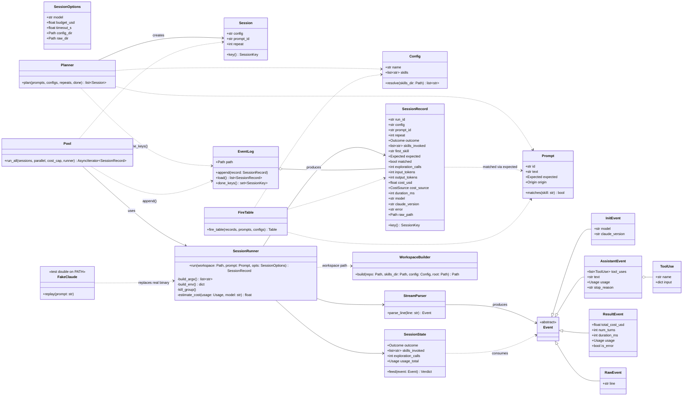

# skillscope iteration 1: runner spike — design

Date: 2026-09-27. Status: approved in brainstorming, pending written review.
Parent document: `Skill Catalog Optimizer Project Overview.md` (Sep 26, 2026).

## 1. Goal and scope

Build only the path from a hand-written prompt file and a folder of skills to a
fire-count table, so the week-2 gate (due Oct 10, 2026) is judged on real
numbers. In scope: planner, workspace builder, session wrapper, stream parser,
pool, JSONL event log, terminal fire table, fake `claude` binary, fixtures, and
the gate run itself. Out of scope: profiler, catalog loader, registry, prompt
generation, static gate, analysis beyond counts, SQLite, HTML report, `apply`,
mypy, CI.

## 2. Decisions made during brainstorming

| Topic | Decision | Reason |
| --- | --- | --- |
| Plan scope | Iteration 1 only | The gate can kill the rest; planning past it is waste |
| Isolation and auth | `claude --bare` with `ANTHROPIC_API_KEY`; `CLAUDE_CONFIG_DIR` pointed at a scratch dir | This machine has the superpowers plugin, a global CLAUDE.md and synced skills that would contaminate every measured session. `--bare` skips hooks, plugins, CLAUDE.md discovery and OAuth |
| Turn cap | Early stop on first decision, plus `--max-budget-usd` and a wall-clock timeout as backstops | `--max-turns` does not exist in Claude Code 2.1.280 (checked). The trigger decision is the first `Skill` tool_use or the first assistant turn that ends without one |
| Runner approach | Subprocess + streaming parser + kill (approach A) | Cheapest, matches the doc's "one wrapper file", fully testable with a fake binary. Rejected: Agent SDK with PreToolUse deny hook (new dependency, `--bare` skips hooks); run-to-completion (3–5x cost, ambiguous "fired") |
| Package shape | Real uv package, `src/skillscope` layout, pytest, ruff; Typer and Pydantic only where they earn it | Nothing to retrofit if the gate passes, no time on mypy or CI if it fails |
| Store | `events.jsonl` only, flush and fsync per record | SQLite arrives in iteration 2 when cross-run comparison exists |
| Gate design | Size ladder `minimal` (5) / `medium` (15) / `full` (30), 3 repeats | Two configs confound shadowing with "fewer choices"; one repeat is noise |
| "Fired" means | First `Skill` call in the session | Later calls are still recorded in `skills_invoked` |
| Gate number | Wrong-or-none rate on `full` minus `minimal` ≥ 15 points, `medium` in between | Committed now so the gate is not judged by feel |
| Spend ceiling | About $20 for all of iteration 1; pool cost cap defaults to $5 per scan | Room for the gate run twice plus probes |
| Gate ecosystem | Next.js / TypeScript | Richest supply of public skills for expected and distractor sets |
| Gate authoring | Claude drafts repo, skills and prompts; user reviews before any spend | Prompts are a checkpoint, not an afterthought |
| Workspace | One per config, shared by concurrent sessions | Tools are read-only, so 3 copies instead of 360 |
| Python | 3.12 via uv | System Python is 3.11; uv installs 3.12 |

## 3. Facts checked against the installed Claude Code (2.1.280)

- `--max-turns` is absent. `--max-budget-usd <amount>` exists (print mode only).
- `--bare` exists: skips hooks, plugins, LSP, plugin sync, auto-memory, keychain,
  CLAUDE.md auto-discovery; auth is strictly `ANTHROPIC_API_KEY`. Its help says
  "Skills still resolve via /skill-name", which may mean project skills are not
  listed to the model under `--bare`. This is the day-0 probe's first question.
- `--setting-sources` accepts `user, project, local`. `settings.local.json` is
  the `local` source, so the overview's plan to write the tool allowlist there
  under `project` only would silently not apply. The tool allowlist goes on the
  command line instead (`--tools`, `--allowedTools`).
- `--tools <names>` restricts the built-in set; `Skill` is a built-in and may
  need to be named explicitly. `--permission-prompts none` denies anything that
  would prompt. Both are probed on day 0.
- `--output-format stream-json` with `--verbose` and `--include-partial-messages`
  exist. Partial messages are not used; whole assistant messages are enough.

## 4. Architecture

### 4.1 Day-0 probe (throwaway, before any package code)

A shell script under `scratch/` (not committed) builds a temp project with one
trivial skill whose description obviously matches a prompt, and runs:

```
CLAUDE_CONFIG_DIR=<scratch> claude -p "<prompt>" --bare --model haiku \
  --output-format stream-json --verbose --tools Read,Grep,Glob,Skill \
  --allowedTools Read,Grep,Glob,Skill --permission-prompts none \
  --max-budget-usd 0.05
```

It answers, in order:

1. Is the project skill listed to the model under `--bare` (does a `Skill`
   tool_use appear)? If not, retry without `--bare` using `--setting-sources
   project` plus `--settings '{...}'` and the same `CLAUDE_CONFIG_DIR`; if that
   works, isolation switches to that form and the spec is amended.
2. Does omitting `Skill` from `--tools` hide it? Does omitting `--allowedTools`
   cause a denial under `--permission-prompts none`?
3. The exact JSON keys: `Skill` tool_use `input` (expected `skill`), assistant
   `message.usage`, `result` fields (`total_cost_usd`, `num_turns`,
   `duration_ms`, `usage`).
4. Is `~/.claude` untouched, and where do transcripts land under
   `CLAUDE_CONFIG_DIR`?

The probe's stdout is saved as the first fixture. The parser's field names are
read from fixtures, never from memory.

### 4.2 Session lifecycle

```
plan ──> for each config: workspace.build (once) ──> pool ──> session.run (x N)
                                                                  │
                                              stream lines ──> parser ──> state machine
                                                                  │
                                              kill on decision ──> SessionRecord ──> EventLog.append
```

A workspace is the repo copied without `.git` and `node_modules`, plus the
config's skill folders copied into `.claude/skills/`. Concurrent sessions share
it read-only.

### 4.3 Early-stop state machine

State is per session, fed one parsed event at a time:

| Event | Effect |
| --- | --- |
| `init` | record `model`, `claude_version` |
| `assistant` with a tool_use named `Skill` | `skills_invoked.append(input.skill)`; if first, `outcome = fired`, kill |
| `assistant` with other tool_uses (Read, Grep, Glob) | `exploration_calls += n`; continue |
| `assistant` with no tool_use and `stop_reason == end_turn` | `outcome = no_fire`, kill |
| `result` | session ended on its own: keep `fired` if set, else `no_fire`; take cost from `total_cost_usd`, `cost_source = result` |
| wall-clock timeout (default 120 s) | `outcome = timeout`, kill process group |
| process exits non-zero with no `result` | `outcome = error`, stderr tail into `error` |
| `result` with a budget-exceeded marker, or `is_error` | `outcome = budget` or `error` |

Every `assistant` event's `usage` is summed. When the process is killed before
`result`, `cost_usd` is estimated as summed tokens times the model's list price
(a small price table in `session.py`, keyed by model alias) and
`cost_source = estimated`.

## 5. Components

| File | Contract |
| --- | --- |
| `src/skillscope/cli.py` | Typer app. `scan REPO -p prompts.yaml -s SKILLS_DIR -c configs.yaml [-j 4] [-r 3] [-m haiku] [--cost-cap 5.0] [--timeout 120] [--budget 0.05] [-n] [-o DIR]`. `-n` prints the plan (session count per config, estimated cost) and exits. `report DIR` reprints the fire table from an existing run. |
| `src/skillscope/models.py` | Pydantic v2: `Prompt`, `Config`, `Session`, `SessionRecord`, `SessionOptions`. YAML loaders for prompts and configs live here. |
| `src/skillscope/runner/plan.py` | `plan(prompts, configs, repeats, done: set[SessionKey]) -> list[Session]`. Pure. Order: config, then prompt, then repeat. |
| `src/skillscope/runner/workspace.py` | `build(repo, skills_dir, config, root) -> Path`. Copies once per config; raises if a config names a skill folder that does not exist. |
| `src/skillscope/runner/stream.py` | `parse_line(line: str) -> Event`. Pure. Kinds: `InitEvent`, `AssistantEvent(tool_uses, text, usage, stop_reason)`, `ResultEvent`, `RawEvent(line)`. Malformed JSON or unknown `type` becomes `RawEvent`. |
| `src/skillscope/runner/decision.py` | `SessionState.feed(event) -> Verdict | None`. The state machine above, no IO, unit-tested with line sequences. |
| `src/skillscope/runner/session.py` | `async run(workspace, prompt, opts) -> SessionRecord`. The only file that spawns the CLI. Builds argv and env, streams stdout line by line through the parser and state machine, kills the process group on a verdict or timeout, writes raw NDJSON to `raw/<config>_<prompt>_<repeat>.ndjson`. |
| `src/skillscope/runner/pool.py` | `async run_all(sessions, parallel, cost_cap, runner) -> AsyncIterator[SessionRecord]`. Semaphore; checks running cost sum before each start; on cap, stops launching and drains; on first auth error, cancels the rest. `runner` is injected so tests can pass a stub. |
| `src/skillscope/store.py` | `EventLog(path)`: `append(record)` (write, flush, fsync), `load() -> list[SessionRecord]` (skips a torn last line with a warning), `done_keys() -> set[SessionKey]`. |
| `src/skillscope/report/terminal.py` | `fire_table(records, prompts, configs) -> rich.Table`. Rows are skills, columns are configs, cells `fired / expected`, a control-fires column, and per-config summary rows: wrong-or-none rate overall and per repeat, and delta against `minimal`. |
| `tests/fake_claude/claude` | Python script on PATH. Reads the prompt from argv, looks it up in `tests/fixtures/streams/index.json`, streams the transcript with small sleeps. Unknown prompt replays `no_fire.ndjson`. `FAKE_CLAUDE_HANG=1` sleeps forever; `FAKE_CLAUDE_FAIL=1` exits 1 with stderr. |

### 5.1 Class diagram



## 6. Data model

### 6.1 `prompts.yaml`

```yaml
- id: p01
  text: Add a loading skeleton to the dashboard route while data fetches
  expected: nextjs-app-router      # a skill folder name, a list of names, or none
  origin: task                     # task | control
- id: c01
  text: Write a Rust function that parses a TOML file
  expected: none
  origin: control
```

### 6.2 `configs.yaml`

```yaml
minimal: [nextjs-app-router, react-components, tailwind, vitest, typescript-style]
medium:  [nextjs-app-router, react-components, tailwind, vitest, typescript-style,
          <10 near distractors>]
full: "*"                          # every folder in the skills dir
```

### 6.3 `events.jsonl`

One `SessionRecord` per line. `SessionKey = (config, prompt_id, repeat)` is
unique; the planner enforces it on resume. `matched` is `true` if `first_skill`
is in `expected`, `false` if not, `null` when `expected` is `none`. A control
prompt that fires any skill is a control fire.

### 6.4 Run folder

```
.skillscope/runs/<YYYYMMDD-HHMMSS>/
  events.jsonl
  prompts.yaml        copy of the input
  configs.yaml        copy of the input
  raw/<config>_<prompt_id>_<repeat>.ndjson
```

`.skillscope/` is gitignored.

## 7. Error handling and resume

- A non-zero exit, unparseable stream or missing key on one session yields an
  `error` record; the pool continues.
- Pre-flight: `scan` refuses to start if `ANTHROPIC_API_KEY` is unset. If the
  first completed session reports an auth error, the pool cancels the rest.
- Timeout and budget kill the process group and record partial `skills_invoked`.
- Cost cap: checked before each start; on hit, stop launching, drain, and mark
  the run partial with the count of unrun sessions in the report.
- Resume: rerunning `scan` with the same `-o DIR` plans only missing keys.
- Ctrl-C: cancel the pool, kill children, log stays consistent (fsync per record).

## 8. Testing

- Parser unit tests over `tests/fixtures/streams/`: fire, no-fire, explore-then-
  fire, budget stop, malformed line, result-only tail. The day-0 probe output is
  the first fixture; others are recorded during the first live runs.
- State-machine unit tests over event sequences, asserting outcome and kill point.
- `fake_claude` integration: 4 sessions in parallel, kill the run midway, rerun,
  assert exactly one record per key; timeout path via `FAKE_CLAUDE_HANG`; error
  path via `FAKE_CLAUDE_FAIL`; `~/.claude` untouched (assert `CLAUDE_CONFIG_DIR`
  is set to the scratch dir in the fake's recorded env).
- One live smoke test, skipped unless `SKILLSCOPE_LIVE=1`.
- TDD throughout.

## 9. Gate execution plan

- Repo: a small public Next.js app cloned at a pinned commit into
  `tests/fixtures/repos/` (shortlist of 2–3 presented in the plan; user picks).
- Skills: 5 expected (app router, React components, Tailwind, Vitest or
  Playwright, TypeScript style), 10 near distractors (other frontend or JS
  skills), 15 far distractors (Python, Rust, data, DevOps). Public catalogs,
  pinned by commit, vendored under `tests/fixtures/skills/` with licences noted.
- Prompts: 30 task prompts labelled with one of the 5 expected skills, 10
  controls with `expected: none`. Presented for user edit before any run.
- Run: 3 configs × 40 prompts × 3 repeats = 360 sessions, Haiku, cost cap $5,
  4 parallel. Expected under $5 and under 20 minutes.
- Decision rule: wrong-or-none rate on `full` minus `minimal` ≥ 15 points, and
  `medium` between them. Per-repeat rates are printed so the noise band is
  visible next to the effect. If the rule fails, iteration 2 does not start
  until the cause is understood.

## 10. Order of work

1. Day-0 probe; save fixture; amend section 3 and 4.1 if the isolation form changes.
2. Package skeleton: `pyproject.toml` (uv, Python 3.12, Apache-2.0), `src/skillscope`, pytest, ruff.
3. `models.py`, `stream.py`, `decision.py` with unit tests.
4. `fake_claude`, `session.py`, `workspace.py` with integration tests.
5. `plan.py`, `pool.py`, `store.py`; the parallel-kill-resume test.
6. `report/terminal.py`, `cli.py`.
7. Gate inputs: repo, 30 skills, 40 prompts (user checkpoint).
8. Gate run, read the table, record the decision.

## 11. Risks specific to this iteration

| Risk | Mitigation |
| --- | --- |
| `--bare` hides project skills from the model | Day-0 probe; fallback isolation via `CLAUDE_CONFIG_DIR` + `--setting-sources project` |
| `Skill` tool denied under `--permission-prompts none` | Probe `--allowedTools`; record denial as its own outcome if it occurs |
| Early kill loses `result`, so costs are estimates | `cost_source` field; the live smoke test compares an estimate against a real `result` on one uncut session |
| Skill fires only after long exploration | `exploration_calls` is recorded; if many no-fire sessions show high exploration, raise the budget for one rerun and compare |
| Repo copy per config still large | Exclude `.git`, `node_modules`, `.next`, `dist`; measure copy time on the gate repo |
