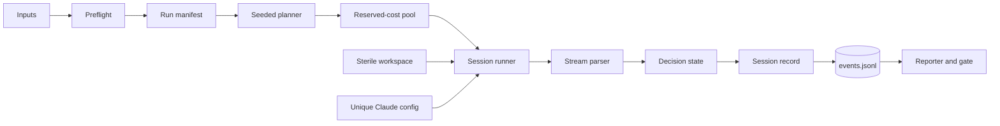

# skillscope iteration 1: runner spike — design

Date: 2026-09-27

Revised: 2026-09-29

Status: approved for implementation

Parent: `Skill Catalog Optimizer Project Overview.md`

Plan: `docs/superpowers/plans/2026-09-27-iteration-1-runner-spike.md`

Terminal UI: `docs/superpowers/specs/2026-09-29-iteration-1-cli-ui.md`

## 1. Goal and boundary

Iteration 1 measures whether catalog growth harms Claude Code skill selection.
It accepts a pinned repository, hand-written prompts, a local folder of skills,
and three explicit catalog configurations. It produces raw stream transcripts,
one durable record per session, selection tables, and a week-2 gate result.

In scope:

- environment and catalog preflight;
- immutable run manifest;
- seeded session planner;
- sterile workspaces;
- headless Claude subprocess wrapper;
- stream parser and early-stop decision state;
- bounded pool with reserved-cost accounting;
- append-only event log and strict resume;
- terminal report and gate evaluation;
- fake Claude integration tests and opt-in live smoke tests.

Out of scope:

- profiler, registry, prompt generation, full static/security gate;
- SQLite, HTML, recommendations, skill overrides, `apply`;
- outcome quality after a skill loads;
- native Windows process control.

## 2. Decisions

| Topic | Decision | Reason |
| --- | --- | --- |
| Platform | Linux or WSL2 | POSIX process groups give reliable descendant termination; native Windows is deferred |
| Python | 3.12 through `uv` | Matches the future package and avoids dependence on system Python |
| Claude compatibility | Probe installed CLI before runner code | Flags and stream shapes change; captured output is the source of truth |
| Skill loading | Probe bare, bare plus add-dir, and isolated project-source modes | Current bare-mode behavior may hide project skills |
| Model | Store and use an explicit full model ID | Floating aliases prevent reproducible comparisons |
| Authentication | API key only; presence checked without printing | Keeps paid runs explicit and avoids personal OAuth/session contamination |
| Measurement | Record first Skill selection and its load result separately | A tool request does not prove the skill loaded successfully |
| Early stop | Terminate after selection is resolved; no-fire on a completed assistant end turn | Captures routing while avoiding full task execution |
| Backstops | Three-turn cap when supported, session budget, wall timeout | Bounds runaway exploration and spend |
| Workspace | One sterile copy per configuration | Only catalog membership should differ between configurations |
| Claude state | Unique config directory per session | Claude writes state; concurrent sessions must not share it |
| Planner | Seeded configuration interleaving | Avoids confounding catalog size with time and rate-limit drift |
| Store | Fsynced JSONL plus immutable manifest | Enough for crash recovery without introducing iteration-2 SQLite |
| Resume | Reject any immutable-input mismatch | Prevents incomparable observations from being combined |
| Cost limit | Reserve session budget before launch | Makes the launch cap meaningful under parallelism |
| Gate | Paired prompt-level size effect with eligibility checks | Repeats of one prompt are not independent prompts |

## 3. Day-zero compatibility probe

Before package code, create one temporary project skill whose description
unambiguously matches one prompt. Run a fire and no-fire prompt in each mode:

1. current directory plus `--bare`;
2. `--bare --add-dir <workspace>`;
3. isolated `CLAUDE_CONFIG_DIR` plus `--setting-sources project`.

Common candidate flags:

```text
claude -p <prompt>
--model <full-model-id>
--output-format stream-json
--verbose
--tools Read,Grep,Glob,Skill
--allowedTools Read,Grep,Glob,Skill
--permission-prompts none
--max-turns 3
--max-budget-usd 0.05
```

The chosen mode must demonstrate:

- init output contains exactly the expected skill;
- personal, synced, plugin, command, agent, hook, MCP, and memory configuration
  is absent;
- the Skill request's exact input field is known;
- the matching tool-result shape and success/error signal are known;
- final result, usage, model, version, cost, turns, and duration fields are known;
- all Claude-written files land below the scratch config;
- the user's normal Claude directory is unchanged;
- tool restrictions and non-interactive permission behavior work;
- three-turn and budget backstops are recognized by the installed version.

Save scrubbed real transcripts as fixtures and amend this section with the
installed version and exact successful argv. Stop if no mode is both sterile and
capable of automatic skill selection.

## 4. Pipeline



Preflight resolves canonical skill identities and validates all relationships.
The manifest freezes those resolved inputs. The planner creates a deterministic,
interleaved order. The pool reserves budget before launching each session. The
session runner is the only component that starts or terminates Claude.

## 5. Component contracts

| Module | Contract |
| --- | --- |
| `models.py` | Typed prompts, configurations, canonical skills, sessions, options, records, manifests, summaries, and gate results |
| `preflight.py` | Validate safe IDs, prompt semantics, SKILL frontmatter, effective names, invocability, config subsets/sizes, symlinks, and runtime support |
| `manifest.py` | Hash immutable inputs, atomically create manifest, compare resume inputs, and render field-level mismatch |
| `runner/plan.py` | Deterministically interleave session keys from seed and filter completed keys without perturbing remaining order |
| `runner/workspace.py` | Create a sterile repository copy and install exactly the ordered canonical skills for one config |
| `runner/stream.py` | Convert each NDJSON line to init, assistant, tool-result, result, or raw event without IO |
| `runner/decision.py` | Track selection, load result, exploration, usage, and terminal outcome; return termination verdicts |
| `runner/process.py` | POSIX process-group creation, graceful termination, forced termination, and descendant cleanup |
| `runner/session.py` | Create unique Claude config, build probed argv/env, stream raw output, drive state, and emit one record |
| `runner/pool.py` | Bound concurrency, reserve cost, stop launches at cap, abort on auth, and yield records to one consumer |
| `store.py` | Append, flush, fsync, load, reject duplicate keys, and recover only a torn last line |
| `report/terminal.py` | Render integrity, selection, config summary, progress, and artifact locations |
| `report/gate.py` | Evaluate eligibility, paired effect, repeat slices, deterministic prompt-cluster bootstrap, and final status |
| `cli.py` | `doctor`, `scan`, and `report`; stable exit codes and non-TTY output |

## 6. Canonical identities

The folder name is source location, not necessarily skill identity. Preflight
parses every `SKILL.md` and determines the effective Claude-visible name using
the behavior confirmed by the probe. It rejects duplicate effective names,
reserved names, missing skills, and expected skills that disable model
invocation.

Prompts, configs, stream selections, reports, and matching all use effective
canonical names. The manifest retains the folder-to-canonical mapping and a
content hash for every skill directory.

Prompt and configuration identifiers must match:

```text
[a-z0-9][a-z0-9_-]{0,63}
```

Raw transcript filenames derive from a safe session-key encoding plus a short
hash. User-controlled strings are never joined directly as unchecked paths.

## 7. Workspace isolation

The builder excludes version-control data, dependencies, generated output, and
previous skillscope data. It removes copied `.claude/skills` before installing
the measured catalog.

Task 2's probe determines whether other project configuration can remain while
still excluding personal configuration. Whichever policy is selected is applied
identically to all three configurations and written to the manifest. External
symlinks are rejected for the gate.

Workspaces are shared only because the allowed repository tools are read-only.
Claude runtime state is never shared: every session gets a unique
`CLAUDE_CONFIG_DIR` below the run directory.

## 8. Stream and decision semantics

The parser recognizes:

- `InitEvent(model, claude_version, skills)`;
- `AssistantEvent(text, tool_uses, usage, stop_reason)`;
- `ToolResultEvent(tool_use_id, content, is_error)`;
- `ResultEvent(subtype, is_error, cost, turns, duration, usage)`;
- `RawEvent(line)`.

Unknown and malformed lines stay in the raw transcript. A structural field
required for a decision produces a session error with the raw path.

State transitions:

| Input | Effect |
| --- | --- |
| init | Record exact model, Claude version, and loaded skill count/names |
| non-Skill tool request | Increment exploration calls and continue |
| first Skill request | Record `selected_skill` and matching tool-use ID |
| matching successful tool result | Set load success and request termination |
| matching error tool result | Set load failure/error and request termination |
| end turn without a selection | Set `no_fire` and request termination |
| result | Preserve selection if present; otherwise derive budget/error/no-fire |
| timeout | Set timeout and terminate process group |
| cancellation | Terminate process group; no completed record unless the caller explicitly creates one |

If the probed version does not expose a Skill tool result before the skill body
would run, terminate at selection and store `skill_load_succeeded = null`. UI
and reports then consistently say “selected,” never “loaded.”

## 9. Process lifecycle

The process controller starts Claude in a new POSIX session. On a decision it:

1. closes further launch intent;
2. sends a graceful group termination;
3. waits a short bounded interval;
4. sends a forced group kill if necessary;
5. awaits stdout/stderr readers and process exit;
6. verifies no test descendant remains.

Cleanup runs for normal decisions, timeout, pool abort, generator close, and
task cancellation. Cleanup errors are recorded without replacing an already
observed selection.

The environment is an explicit safe subset confirmed by the probe. The API key
is passed to the child but never logged, serialized, or included in error text.

## 10. Manifest and resume

The manifest includes schema version, UTC creation time, repository commit and
tree hash, input hashes, per-skill hashes and canonical names, ordered resolved
configs, exact model and Claude versions, tool/isolation/backstop options,
parallelism, repeats, ordering seed, price-table version, and planned keys.

It is written atomically before the first paid launch. Resume recomputes the
immutable portion and requires equality. Differences are printed field by field
and cause exit 2 before workspace creation or API use.

Completed keys come only from validated, unique event records. Filtering them
from the original planned order must not reorder the remaining work.

## 11. Pool and cost semantics

The pool tracks:

```text
observed_cost
reserved_in_flight
session_budget
run_cost_cap
```

A launch is allowed only when observed plus reservations plus the next session
reservation is within the cap. Completion releases its reservation and adds its
observed cost. This is a hard launch cap, not a promise that an external billing
system cannot report delayed or adjusted usage.

An authentication error stops new launches and cancels in-flight work safely.
Other session errors yield records and allow the pool to continue. One consumer
serializes yielded records into `events.jsonl`.

## 12. Gate method

Inputs are 30 task prompts, 10 controls, three catalog sizes, and three repeats.
The planner interleaves catalog configurations within prompt/repeat blocks using
a stored seed.

For each task prompt and config, calculate the fraction of its three repetitions
where `matched is not True`. Average these 30 prompt-level values for the config.
The headline effect is the mean paired `full - minimal` difference across the
same prompts. A deterministic cluster bootstrap samples prompts, not individual
repetitions, to produce a descriptive 95% interval.

Eligibility requires:

- exactly 360 unique completed records;
- correct 5/15/30 skill loading in every session;
- one model and one Claude version;
- no auth failures;
- at most 2% error plus timeout rate per config;
- no unexplained skill-load failures;
- valid manifest and raw transcript references.

Pass requires:

- paired full-minus-minimal degradation of at least 15.0 percentage points;
- monotonic `minimal <= medium <= full` prompt-level mean rates;
- positive full-minus-minimal difference in at least two repeat slices.

An incomplete cost-capped run is `PARTIAL`. A completed run that violates an
eligibility condition is `INELIGIBLE`, not `FAIL`. `FAIL` is reserved for an
eligible run that does not meet the hypothesis gate.

## 13. Testing

- Strict model/loader tests for unsafe IDs, duplicates, frontmatter identities,
  config subsets, and prompt semantics.
- Recorded-stream parser tests for selection, successful/failed load, no-fire,
  exploration, budget, error, malformed, and unknown events.
- Pure decision tests for every transition and termination point.
- Fake-Claude integration tests for slow output, hang, auth error, ordinary
  failure, descendants, cancellation, and stderr capture.
- Workspace tests proving exact catalog membership and configuration stripping.
- Manifest tests proving every immutable difference blocks resume.
- Planner tests proving seeded interleaving and stable resume order.
- Pool tests for concurrency, reservation, cap, auth abort, and exceptions.
- End-to-end interrupt/resume tests proving unique records and no live children.
- Reporter/gate golden tests for PASS, FAIL, PARTIAL, and INELIGIBLE.
- Opt-in real smoke test that requires a final priced result and compares cost;
  it must fail rather than silently skip when the result is absent.

## 14. Run folder

```text
.skillscope/runs/<run-id>/
  run-manifest.json
  prompts.yaml
  configs.yaml
  skills-manifest.json
  events.jsonl
  gate-result.json
  console.log
  raw/<safe-session-key>-<hash>.ndjson
  claude-config/<safe-session-key>-<hash>/
  workspaces/<config>/
```

`.skillscope/` is gitignored. Reports always show artifact paths and the exact
reason when a run is partial or ineligible.

## 15. Known limitations

- Trigger behavior is specific to the pinned model and Claude version.
- Three repeats expose gross noise but do not make this a definitive statistical
  benchmark.
- Selection does not measure whether following the skill improves outcomes.
- Read-only tools reduce risk but do not constitute a hardened sandbox.
- Curated gate skills and prompts can still encode author-selection bias.
- Native Windows execution waits until a process-tree implementation and CI test
  exist.
